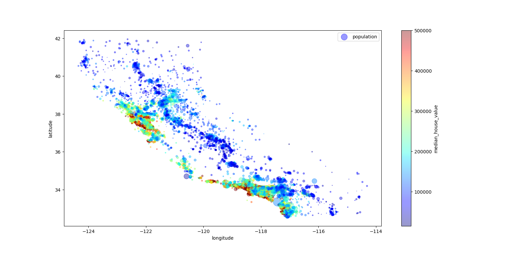
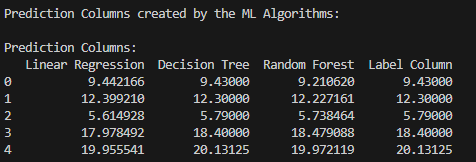

# Machine Learning Projects

This repository contains machine learning projects that explore and analyze datasets to compare the performance of different ML algorithms.

---

## Housing Project



Regression task, from the book "Hands on Machine Learning", to predict the median house price values of thousands of districts from the state of California, USA 1990.

The dataset was acquired from the author of the book: raw.githubusercontent.com/ageron/handson-ml/master/datasets/housing/housing.tgz

The code is located on  ```machine_learning_projects/housing_project/code/housing_data.py```.

## Food Project



Regression task to predict the protein values of thousands of food items based on major food nutrient values: carbohydrate, energy, water, fat and nitrogen.

The datasets were acquired from the U.S Department of Agriculture: fdc.nal.usda.gov/download-datasets

The code is located on  ```machine_learning_projects/food_project/code/food_project.py```.

---

# Environment Setup

### 1. Dependencies
- [Python](https://www.python.org/downloads/)
- Python Packages: matplotlib, numpy, pandas, scipy, scikit-learn, joblib

### 2. Clone the Repository
```bash
git clone https://github.com/thorgalwulf/machine_learning_projects.git
```

### 3. Navigate to the Repository
```bash
cd machine_learning_projects
```

### 4. Create and Activate a Virtual Environment and Install Python Packages
- Windows
```bash
# Create a virtual environment named 'venv'
python -m venv venv

# Activate the virtual environment
venv\Scripts\activate.bat

# Install the specified packages
pip install matplotlib numpy pandas scipy scikit-learn joblib

# Run this import command to check if the packages were installed correctly
python -c "import matplotlib, numpy, pandas, scipy, sklearn, joblib"
```
- Linux
```bash
sudo apt install python3-venv
python3 -m venv venv
source venv/bin/activate

sudo apt install python3-pip
python3 -m pip install matplotlib numpy pandas scipy scikit-learn joblib
python -c "import matplotlib, numpy, pandas, scipy, sklearn, joblib"
```

### 5. Run
```bash
cd food_project/code
python food_project_2.py
```

---

# Repository

```
datasets/          Contains source and reshaped .csv files from the datasets.
datasets_src/      Local dataset files.
food_project/      Food dataset analysis using U.S. Department of Agriculture data.
housing_project/   Housing project from "Hands-On Machine Learning" by Aurélien Géron.
img/               Visualization images generated using Matplotlib.
models/            Trained machine learning models.
venv/              Python virtual environment for dependency management.
.gitignore         Files and folders to be ignored.
README.md          Notes.
```

---
